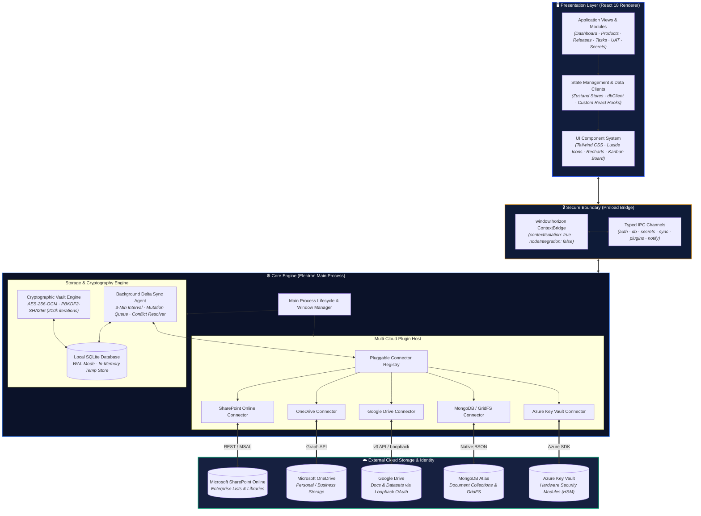

<div align=center>

# 🚀 Horizon PM

### *Enterprise Product Management Platform — Clarity to Impact.*

[](https://opensource.org/licenses/Apache-2.0)
[](https://electronjs.org/)
[](https://reactjs.org/)
[](https://www.typescriptlang.org/)
[](https://sqlite.org/)
[]()

<p align=center>
  <strong>An offline-first, cryptographic, multi-cloud desktop application for high-performing engineering organizations and Product Owners.</strong>
</p>

</div>

---

## 🌟 Overview

**Horizon PM** bridges high-level product strategy and low-level engineering execution. Built on an **offline-first local SQLite WAL architecture**, Horizon delivers sub-millisecond responsiveness with background delta-synchronization to enterprise cloud storage backends: **MongoDB Atlas**, **Google Drive**, **Microsoft SharePoint**, **Microsoft OneDrive**, and **Azure Key Vault**.

Whether you are operating behind restrictive air-gapped corporate firewalls, on flights with no Wi-Fi, or in distributed remote teams, Horizon PM guarantees complete operational continuity with zero downtime.

---

## ✨ Key Features

### 1. 🎯 Product Strategy & Portfolio Architecture
* **Portfolio Health Overview**: Real-time product health classification (Healthy, Needs Attention, Staging).
* **Flexible Application Scoping**: Classify products across customizable scopes (Internal, External, Partner API, SaaS).
* **Custom Workspace Sections**: Add Markdown-powered RFCs, architecture guides, and technical runbooks directly inside product workspaces.
* **Lead Portfolios**: Executive visibility mapping product leads, team capacity, active releases, and blocker tallies.

### 2. 🚢 Release Engineering & UAT Sign-Off Gates
* **Lifecycle Pipeline**: Visual tracking across 6 delivery gates: Planning → Development → QA → UAT → SignOff → Released.
* **Automated UAT Test Suites**: Track functional, integration, and security test cases with pass/fail/blocked states and binary attachment evidence.
* **Executive Quality Gates**: Cryptographic sign-off logging preventing premature releases until 100% test case criteria are satisfied.

### 3. 📋 Agile Task Management & Kanban
* **Interactive Kanban Board**: Drag-and-drop workflow (Todo, InProgress, Blocked, Done).
* **Smart Filter Matrices**: Filter by product, target release, priority (Critical, High, Medium, Low), and team assignee.
* **Proactive Blocker Escalation**: Surfaces critical blocked tasks directly on executive oversight dashboards.

### 4. 🔐 Cryptographic Secrets Vault
* **Military-Grade Encryption**: Local credentials and API keys are protected using **AES-256-GCM** with **PBKDF2-SHA256 (210,000 iterations)**.
* **Zero Plaintext Storage**: Plaintext secrets never touch disk or persistent database columns.
* **Independent Master Key**: Vault master password is decoupled from user login passwords—preventing accidental credential exposure when account passwords change.
* **Zero-Downtime Passphrase Rotation**: Rotate master passphrases at any time with automatic in-memory decryption and batch re-encryption of all stored secrets.
* **Cloud HSM Integration**: Seamlessly connect to **Azure Key Vault** to browse, reveal, and rotate hardware-secured cloud secrets inline.

### 5. ☁️ Multi-Cloud Hybrid Storage & Synchronization
Horizon provides pluggable, unified cloud synchronization with automatic delta-tracking:
* **MongoDB Enterprise / Atlas**: Full document collections synchronization with GridFS binary document storage.
* **Google Drive**: Personal (@gmail.com) and Google Workspace synchronization with zero-dependency loopback OAuth 2.0 (http://127.0.0.1:8585).
* **Microsoft SharePoint Online**: Syncs domain entities with enterprise SharePoint Lists and Shared Document Libraries.
* **Microsoft OneDrive for Business**: Standard organization folder sync (/HorizonPM/Documents).
* **Automated Delta Sync Agent**: Runs background sync cycles every 3 minutes, resolving conflicts via deterministic last-write-wins with audit logging.

### 6. 👥 Team Availability, HR & Scheduling
* **Availability Legend**: Live team roster tracking (Available, WFH / Remote, On Leave, Partial).
* **Emergency Contacts & Skill Tags**: Centralized technical expertise directory.
* **Configurable Notification Windows**: Customizable lookahead lead time for release milestones and cutover alerts.

### 7. 🛡️ Role-Based Access Control (RBAC)
* **Product Owner (ProductOwner)**: Full administrative governance, credential management, plugin configuration, and audit log inspection.
* **Management (Management)**: Executive dashboard metrics, release roadmaps, and blocker oversight.
* **Team Member (TeamMember)**: Focused access to assigned tasks, product specifications, and test cases.

---

## 🏗️ Architecture



---

## 🚀 Getting Started

### Prerequisites
* **Node.js**: v18.0.0 or higher
* **npm**: v9.0.0 or higher
* **Git**: Installed and configured

### Installation & Development

1. **Clone the repository:**
   ```bash
   git clone https://github.com/HumanNai/Horizon.git
   cd Horizon
   ```

2. **Install dependencies:**
   ```bash
   npm install
   ```

3. **Start in development mode:**
   ```bash
   npm run dev
   ```

### Default Bootstrap Credentials
Upon fresh initialization, Horizon creates an offline bootstrap administrator account:
* **Username**: `admin`
* **Password**: `horizon123`
*(Make sure to change this password in the Access / Settings section upon first login).*

---

## 📦 Building & Packaging

To compile and package self-contained, production-ready Windows installers and portable executables:

```bash
# Build the Vite renderer and Electron main bundles
npm run build

# Package portable executable and NSIS installer
npm run package
```

Packaged outputs will be generated in `release/`:
* `Horizon-Setup-1.0.0.exe` (NSIS Installer)
* `Horizon-1.0.0-portable.exe` (Standalone Portable Executable)
* `Horizon-1.0.0-win-unpacked.zip` (Complete Unpacked Application Archive)
* `Horizon.exe` (Convenience launcher)

---

## 📁 Project Structure

```mermaid
flowchart TD
    subgraph Root["📁 Horizon Repository Root"]
        direction TB

        subgraph B_Electron["⚡ electron/ — Main Process"]
            direction TB
            E_Main["main.ts<br/><i>App Lifecycle & Window Host</i>"]
            E_Preload["preload.ts<br/><i>Typed ContextBridge API</i>"]
            E_DB["db/<br/><i>SQLite Schema, WAL & Migrations</i>"]
            E_IPC["ipc/<br/><i>Auth, DB, Secrets, Sync & Notifications</i>"]
            subgraph E_Plugins["plugins/ — Multi-Cloud Connectors"]
                direction LR
                P1["azure-keyvault/"]
                P2["google-drive/"]
                P3["mongodb/"]
                P4["onedrive/"]
                P5["sharepoint/"]
            end
            E_Main --> E_IPC
            E_IPC --> E_DB
            E_IPC --> E_Plugins
        end

        subgraph B_Src["⚛️ src/ — React 18 Frontend"]
            direction TB
            S_Pages["pages/<br/><i>Dashboard · Products · Releases · Tasks · Secrets · UAT</i>"]
            S_Store["store/<br/><i>Zustand Stores & SQLite dbClient</i>"]
            S_Comp["components/<br/><i>UI Kit, KanbanBoard & PipelineBar</i>"]
            S_Hooks["hooks/<br/><i>Sync, Notifications & Maximizer</i>"]
            S_Types["types/<br/><i>Domain Models & Shared Contracts</i>"]
            S_Pages --> S_Store
            S_Store --> S_Comp
            S_Store --> S_Types
        end

        subgraph B_Config["⚙️ Configuration & Tooling"]
            direction TB
            C_Build["build/ & images/<br/><i>Icons, Logos & Packaging Assets</i>"]
            C_Cfg["electron.vite.config.ts<br/><i>Vite Multi-Bundle Bundler</i>"]
            C_Bld["electron-builder.config.js<br/><i>NSIS & Portable Packaging</i>"]
            C_GH[".github/<br/><i>CI/CD Pipelines & Issue Templates</i>"]
        end

        Root --> B_Electron
        Root --> B_Src
        Root --> B_Config
    end

    classDef rootStyle fill:#0B1229,stroke:#2E5EFF,stroke-width:2px,color:#ffffff;
    classDef subStyle fill:#111d3c,stroke:#1e2d52,stroke-width:1px,color:#ffffff;
    classDef nodeStyle fill:#162040,stroke:#3b82f6,stroke-width:1px,color:#ffffff;

    class Root rootStyle;
    class B_Electron,B_Src,B_Config,E_Plugins subStyle;
    class E_Main,E_Preload,E_DB,E_IPC,P1,P2,P3,P4,P5,S_Pages,S_Store,S_Comp,S_Hooks,S_Types,C_Build,C_Cfg,C_Bld,C_GH nodeStyle;
```

<details>
<summary><b>📂 Full Directory Tree View</b> (click to expand)</summary>

```text
├── .github/
│   ├── ISSUE_TEMPLATE/       # Bug report & feature request templates
│   ├── PULL_REQUEST_TEMPLATE.md
│   └── workflows/ci.yml      # GitHub Actions CI workflow
├── build/                    # Packaging assets & executable icons
├── electron/                 # Electron main process source
│   ├── db/                   # SQLite schema, migrations, and table definitions
│   ├── ipc/                  # Typed IPC handlers (auth, db, secrets, sync, notify)
│   ├── plugins/              # Multi-cloud storage adapters
│   │   ├── azure-keyvault/   # Azure Key Vault connector
│   │   ├── google-drive/     # Google Drive v3 connector
│   │   ├── mongodb/          # MongoDB Atlas & GridFS connector
│   │   ├── onedrive/         # OneDrive for Business connector
│   │   └── sharepoint/       # SharePoint Online connector
│   ├── main.ts               # Main process bootstrap & lifecycle
│   └── preload.ts            # Secure context bridge API
├── images/                   # App logos & branding graphics
├── src/                      # React 18 frontend
│   ├── assets/               # Bundled UI images
│   ├── components/           # Reusable UI component library & layouts
│   ├── hooks/                # Custom React hooks (sync, notifications)
│   ├── layouts/              # AppShell layout with custom titlebar
│   ├── pages/                # Application views (Dashboard, Products, Releases, Secrets...)
│   ├── store/                # Zustand state management stores
│   └── types/                # Shared TypeScript domain contracts
├── CODE_OF_CONDUCT.md        # Contributor Covenant v2.1
├── CONTRIBUTING.md           # Contribution guidelines
├── LICENSE                   # Apache License 2.0
├── NOTICE                    # Attribution and third-party notices
├── README.md                 # Project documentation
├── SECURITY.md               # Security and vulnerability policy
└── package.json
```

</details>

---

## 🤝 Contributing

We welcome contributions from the community! Please check our [Contributing Guidelines](CONTRIBUTING.md) and [Code of Conduct](CODE_OF_CONDUCT.md) before submitting pull requests.

1. Fork the Project
2. Create your Feature Branch (git checkout -b feature/AmazingFeature)
3. Commit your Changes (git commit -m 'feat: Add AmazingFeature')
4. Push to the Branch (git push origin feature/AmazingFeature)
5. Open a Pull Request

---

## 🔒 Security

For vulnerability disclosure and security reporting guidelines, please consult our [Security Policy](SECURITY.md).

---

## 📄 License

Horizon PM is open-source software licensed under the **[Apache License, Version 2.0](LICENSE)**.

```text
Copyright 2024-2026 Horizon Contributors

Licensed under the Apache License, Version 2.0 (the License);
you may not use this file except in compliance with the License.
You may obtain a copy of the License at

    http://www.apache.org/licenses/LICENSE-2.0
```
